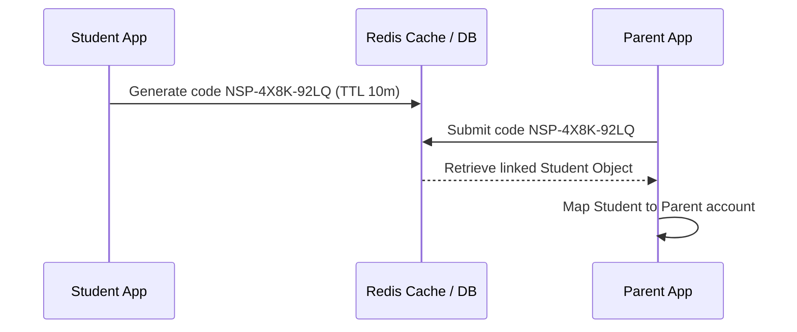

# Spec for Phase 2: Backend Integration (Updated for OTP & Linking Code)

This document details the database schema modifications, OTP authentication flows, and API endpoints required in `noteswift-backend` during Phase 2 to support the Parent Portal.

---

## 1. Authentication & Roles Expansion

The backend authentication payload needs to support the `parent` role.

### Required Changes:
* **Extend `SessionPayload` and `AuthUser` roles**:
  ```typescript
  export interface SessionPayload {
      user_id: string;
      role: "admin" | "student" | "teacher" | "parent"; // Add "parent"
      iat?: number;
      exp?: number;
  }
  ```
* **Authentication Middleware**:
  Extend route guard middleware in the backend (`src/apps/teacher/middlewares/auth.ts` or sibling folders) to authenticate and validate JWTs with the `parent` role.

---

## 2. Database Models & Schema Extensions

A parent entity must be introduced with **no password hash** fields, using temporary OTP logs for authentication, and student linking relationships.

### A. Parent Schema (`Parent.ts` - New Model)
```typescript
import { Schema, model, Document } from "mongoose";

export interface TParent extends Document {
  email?: string;                      // Optional email
  fullName: string;
  phoneNumber: string;                 // Unique key, format: +977-98XXXXXXXX
  avatarEmoji: string;
  linkedStudents: Schema.Types.ObjectId[]; // Array of links to Student IDs
  notificationPreferences: {
    emailDigest: boolean;
    smsAlerts: boolean;
    pushAlerts: boolean;
  };
  createdAt: Date;
  updatedAt: Date;
}

const ParentSchema = new Schema<TParent>({
  email: { type: String, unique: true, sparse: true, lowercase: true },
  fullName: { type: String, required: true },
  phoneNumber: { type: String, required: true, unique: true },
  avatarEmoji: { type: String, default: "NP" },
  linkedStudents: [{ type: Schema.Types.ObjectId, ref: "Student" }],
  notificationPreferences: {
    emailDigest: { type: Boolean, default: true },
    smsAlerts: { type: Boolean, default: true },
    pushAlerts: { type: Boolean, default: false }
  }
}, { timestamps: true });

export const ParentModel = model<TParent>("Parent", ParentSchema);
```

### B. OTP Verification Schema (`OtpVerification.ts` - New Model)
Used to track pending log-in and registration attempts.
```typescript
import { Schema, model, Document } from "mongoose";

export interface TOtpVerification extends Document {
  phoneNumber: string;
  otpCode: string;
  expiresAt: Date;
  purpose: "login" | "register";
  metadata?: {                         // Stores registration details temporarily until OTP is verified
    fullName?: string;
    email?: string;
  };
  createdAt: Date;
}

const OtpVerificationSchema = new Schema<TOtpVerification>({
  phoneNumber: { type: String, required: true },
  otpCode: { type: String, required: true },
  expiresAt: { type: Date, required: true, index: { expires: 0 } }, // TTL index auto-deletes expired OTPs
  purpose: { type: String, enum: ["login", "register"], required: true },
  metadata: {
    fullName: { type: String },
    email: { type: String }
  }
}, { timestamps: true });

export const OtpVerificationModel = model<TOtpVerification>("OtpVerification", OtpVerificationSchema);
```

---

## 3. Required API Endpoints

### A. Authentication & Account (OTP-Based)

#### **`POST /api/parent/auth/send-otp`**
* **Request Body**:
  ```json
  {
    "phoneNumber": "+977-9841234567",
    "purpose": "login" // or "register"
  }
  ```
* **For Registration extra properties**:
  ```json
  {
    "phoneNumber": "+977-9841234567",
    "purpose": "register",
    "fullName": "Reena Sharma",
    "email": "reena@example.com"
  }
  ```
* **Backend logic**:
  1. Validates the phone format.
  2. If `purpose === "register"`, verifies that the phone number is not already associated with a Parent account.
  3. Generates a random 6-digit numeric OTP code.
  4. Saves to the `OtpVerification` collection (deletes any existing pending OTPs for this number first) with a 5-minute expiry.
  5. dispatches the OTP via the configured SMS gateway (e.g. Sparrow SMS, Aakash SMS, or Twilio).

#### **`POST /api/parent/auth/verify-otp`**
* **Request Body**:
  ```json
  {
    "phoneNumber": "+977-9841234567",
    "otpCode": "123456"
  }
  ```
* **Backend logic**:
  1. Checks if a record exists matching the `phoneNumber` and `otpCode` in `OtpVerification`.
  2. If expired or not found, returns `400 Bad Request`.
  3. If found and `purpose === "login"`:
     * Resolves the existing Parent record.
     * Signs JWT token.
     * Deletes the verification record.
  4. If found and `purpose === "register"`:
     * Creates a new Parent record using the saved registration metadata (`fullName`, `email`, etc.).
     * Signs JWT token.
     * Deletes the verification record.
* **Response**:
  ```json
  {
    "token": "JWT_TOKEN_HERE",
    "parent": {
      "id": "parent_id",
      "fullName": "Reena Sharma",
      "phoneNumber": "+977-9841234567",
      "email": "reena@example.com",
      "avatarEmoji": "RS"
    },
    "children": [] // Array of linked children profiles
  }
  ```

---

## 4. Student Linking Code Flows

To link a parent and student securely, the backend will exchange a short-lived link code generated by the student.



### A. Student App Endpoints (Student Dashboard Context)

#### **`POST /api/student/generate-link-code`**
* **Auth**: Requires Student Bearer Token
* **Backend Logic**:
  1. Generates a unique, short-lived alpha-numeric code in the format: `NSP-XXXX-XXXX` (e.g., `NSP-4X8K-92LQ`).
  2. Stores this key in Redis or database cache:
     * Key: `student-link:${linkCode}`
     * Value: `studentId` (Object ID of active student)
     * TTL: 600 seconds (10 minutes)
* **Response**:
  ```json
  {
    "linkCode": "NSP-4X8K-92LQ",
    "expiresInSeconds": 600
  }
  ```

### B. Parents Portal Endpoints (Parent Dashboard Context)

#### **`POST /api/parent/link-student`**
* **Auth**: Requires Parent Bearer Token
* **Request Body**:
  ```json
  {
    "linkCode": "NSP-4X8K-92LQ"
  }
  ```
* **Backend Logic**:
  1. Validates the code format.
  2. Fetches the active value for `student-link:${linkCode}` from cache/Redis.
  3. If key is expired or not found, returns `400 Bad Request` ("Code expired or invalid").
  4. Resolves the corresponding `studentId`.
  5. Verifies if this student is already linked to this parent (checking `tp.linkedStudents`). If yes, returns `400` ("Student already linked").
  6. Updates the Parent record: pushes `studentId` into the `linkedStudents` array.
  7. Deletes the link code from cache immediately to prevent reuse.
* **Response**:
  ```json
  {
    "success": true,
    "message": "Student linked successfully",
    "linkedStudent": {
      "id": "student_id",
      "fullName": "Aarav Sharma",
      "rollNo": 12,
      "grade": "Grade 10 (Section A)"
    }
  }
  ```

---

## 5. Frontend Production-Ready Configuration Toggle

The frontend features a dual-mode integration toggle located in `src/config/app-config.ts`. 

### How it works:
* **Demo Mode (`USE_MOCK_DATA === true` / Default)**:
  - The auth context uses static client-side databases (`mockDatabase` in `src/data/mockData.ts`).
  - No network requests are made.
  - OTP bypass codes (`123456`) and mock linking codes (`NSP-4X8K-92LQ`) are hardcoded.
* **Production Mode (`USE_MOCK_DATA === false`)**:
  - Authentication calls, registration flows, OTP validation, child linking, and settings edits dispatch standard HTTP `fetch()` requests directly to your backend APIs.
  - You must supply `NEXT_PUBLIC_USE_MOCK_DATA=false` and `NEXT_PUBLIC_API_URL` to configure the gateway.

### Expected Backend API Specifications

The following endpoints are called by the frontend when in Production mode:

#### 1. OTP Sending (`POST /api/parent/auth/send-otp`)
- **Request Body**:
  ```json
  {
    "phoneNumber": "98XXXXXXXX",
    "purpose": "login" // or "register",
    "fullName": "Reena Sharma", // registration only
    "email": "reena@example.com" // registration only
  }
  ```
- **Response**:
  ```json
  {
    "success": true
  }
  ```

#### 2. OTP Verification (`POST /api/parent/auth/verify-otp`)
- **Request Body**:
  ```json
  {
    "phoneNumber": "98XXXXXXXX",
    "otpCode": "123456"
  }
  ```
- **Response**:
  ```json
  {
    "token": "JWT_TOKEN_HERE",
    "parent": {
      "id": "p-12345",
      "fullName": "Reena Sharma",
      "phoneNumber": "9841234567",
      "email": "reena.sharma@example.com",
      "avatarEmoji": "RS"
    },
    "children": [
      {
        "id": "c1",
        "fullName": "Aarav Sharma",
        "rollNo": 12,
        "grade": "Grade 10 (Section A)",
        "avatarEmoji": "AS"
      }
    ]
  }
  ```

#### 3. Student Linking (`POST /api/parent/link-student`)
- **Headers**:
  ```http
  Authorization: Bearer JWT_TOKEN_HERE
  ```
- **Request Body**:
  ```json
  {
    "linkCode": "NSP-4X8K-92LQ"
  }
  ```
- **Response**:
  ```json
  {
    "success": true,
    "linkedStudent": {
      "id": "c1",
      "fullName": "Aarav Sharma",
      "rollNo": 12,
      "grade": "Grade 10 (Section A)",
      "avatarEmoji": "AS"
    }
  }
  ```

#### 4. Profile Modification (`PUT /api/parent/profile`)
- **Headers**:
  ```http
  Authorization: Bearer JWT_TOKEN_HERE
  ```
- **Request Body**:
  ```json
  {
    "fullName": "Reena Sharma",
    "phoneNumber": "9841234567"
  }
  ```
- **Response**:
  ```json
  {
    "success": true
  }
  ```

